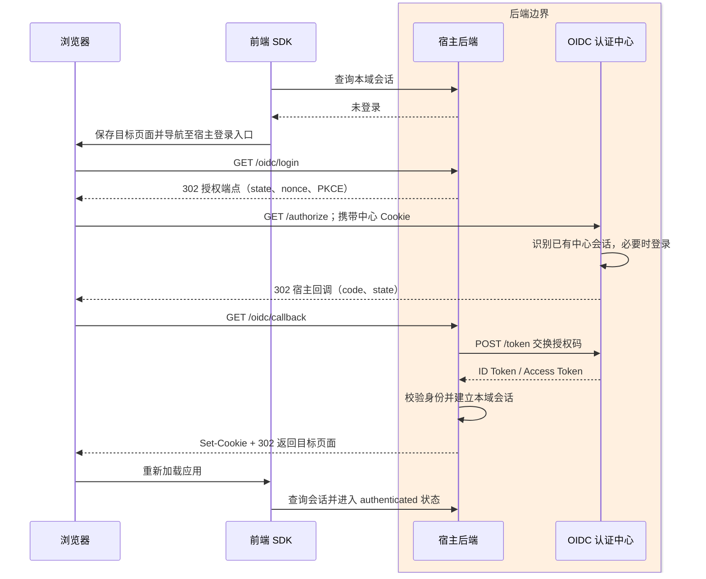
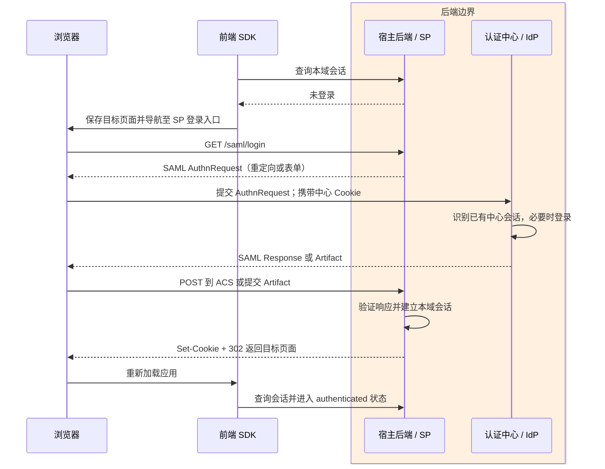
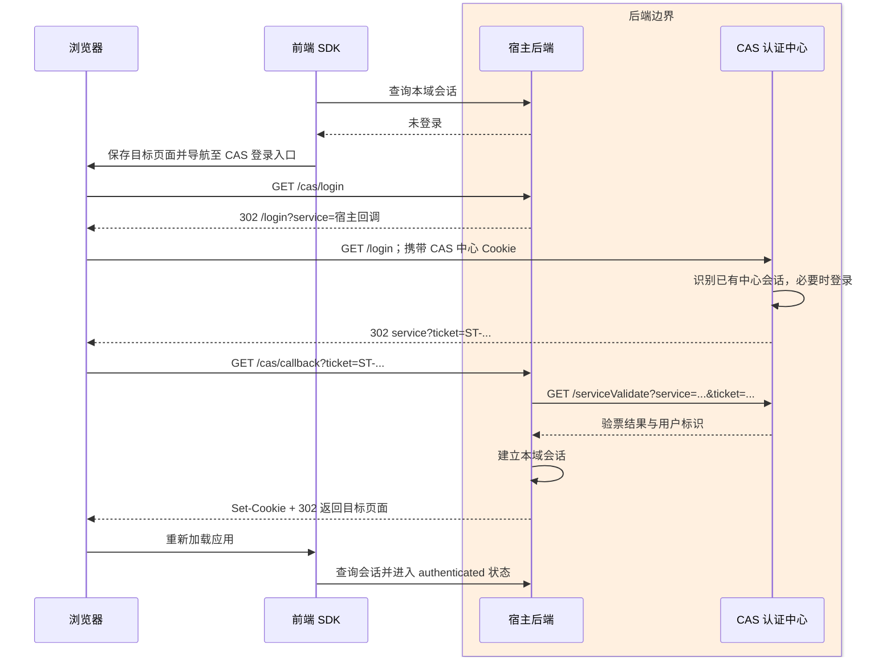
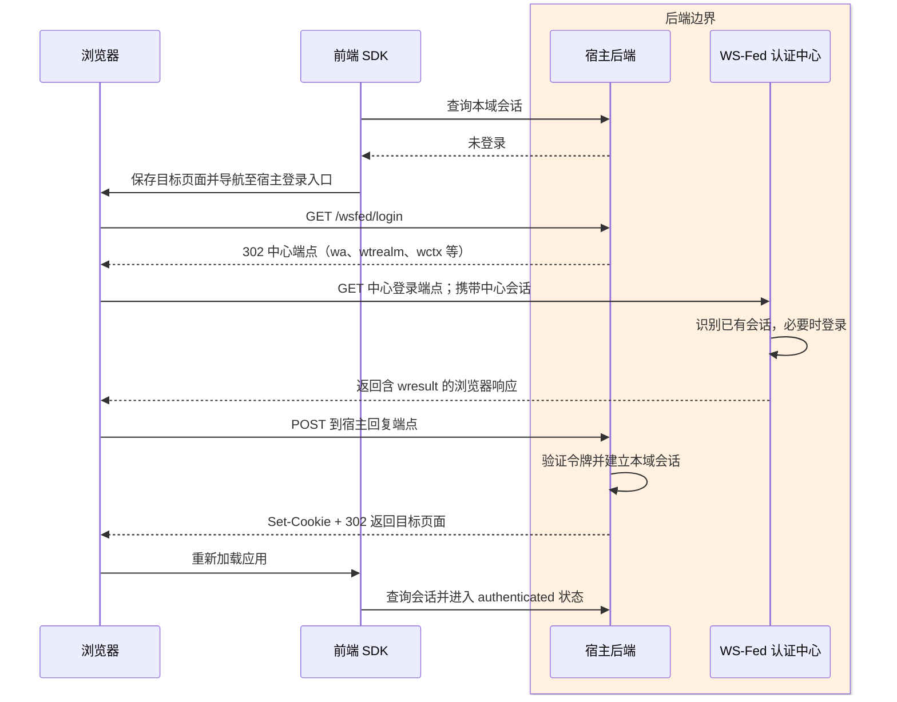
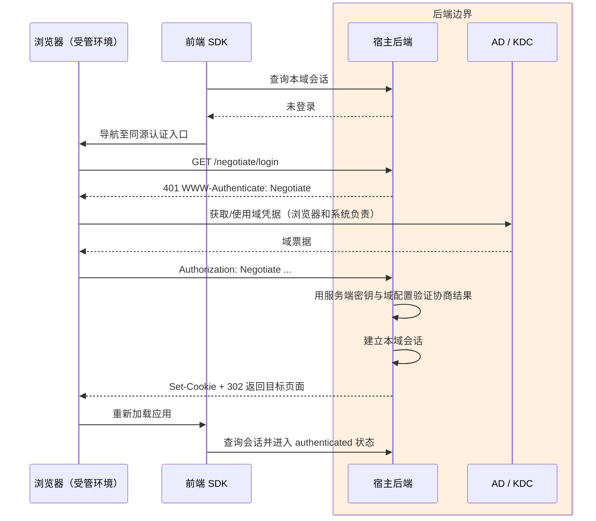
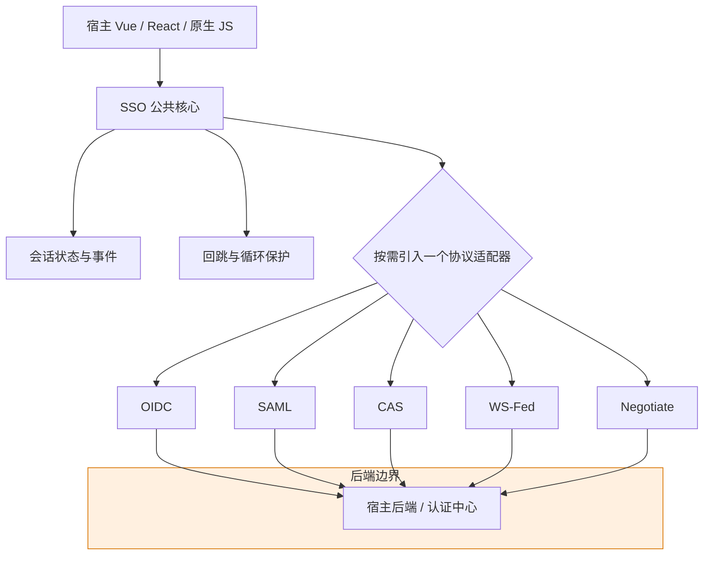

# SSO 前端 SDK：五种标准方案调研与设计草案

状态：方案已确定，原型实现中；实测范围见 [浏览器夹具记录](../tasks/browser-evidence-2026-10-01.md)。日期：2026-10-01。

## 共同目标与边界

目标是在同一浏览器中登录认证中心一次，随后访问其他已接入应用时无需再次输入凭据。每个宿主项目已有后端。认证中心负责统一身份会话；宿主后端负责验证认证结果、建立本域会话和保护业务 API；前端 SDK 负责发起流程、恢复页面、查询会话及维护界面状态。业务权限仍由各业务系统决定。

**产品验收目标：** 当宿主后端实现了受支持的标准 SSO 协议及必要的本域会话能力时，业务方安装一个 SDK 包、选择协议适配器、填写有限的宿主配置，再在应用入口和受保护页面接入公共方法，即可完成登录、登录态恢复和登出；不复制协议流程代码。常见的端点路径、宿主入口参数名称、会话响应结构和页面导航差异应由受约束的配置吸收，标准协议规定的参数语义保持不变。

本调研的五种方案是 OIDC、SAML 2.0、CAS、WS-Federation、HTTP Negotiate/Kerberos。前四种是跨应用身份联邦或票据协议；第五种是企业内网浏览器与服务器之间的集成认证机制，部署前提不同。OAuth 2.0 本身是授权框架，OIDC 才定义身份认证；Cookie、JWT、LDAP/AD 分别是会话载体、令牌格式、身份来源，不单独构成浏览器 SSO 协议。[OIDC Core](https://openid.net/specs/openid-connect-core-1_0-18.html)

前端 SDK 的公共状态建议为 `unknown → checking → authenticated | unauthenticated | error`。公共 API 暂定 `init`、`getSession`、`login`、`logout`、`onAuthChange`；协议专属参数放在独立适配器中。`getAccessToken` 只属于浏览器持令牌的 OIDC 模式，不强加给基于宿主 Cookie 的模式。所有模式都应防止自动登录跳转循环，保存并校验回跳地址；同一宿主的多标签页可同步界面状态，跨域状态仍以服务端为准。

下列流程图中，**着色方框是后端边界**；方框外是浏览器和前端 SDK。图中的“宿主后端”也可由部署在宿主域名下的统一网关承接。

## 1. OIDC：授权码流程

**认证中心提供：** OIDC 发现文档、授权端点、令牌端点、签名公钥；按需提供 UserInfo、结束会话端点。为宿主注册 `client_id` 和精确的回调地址；支持授权码与 PKCE。[OIDC Discovery](https://openid.net/specs/openid-connect-discovery-1_0-final.html)、[RFC 9700](https://www.rfc-editor.org/rfc/rfc9700.html)

**宿主后端负责：** 发起授权请求，保存 `state`、`nonce` 和 PKCE 验证材料；接收授权码并向中心换取令牌；校验身份令牌签名、签发者、受众和有效期；建立本域会话并保护 API。若选择纯浏览器公开客户端，换码和持令牌职责转到前端适配器，同时需要中心允许令牌端点 CORS，宿主 API 接受访问令牌。首版优先研究有后端的模式。[OIDC Core](https://openid.net/specs/openid-connect-core-1_0-18.html)、[RFC 10017](https://www.rfc-editor.org/rfc/rfc10017.html)

**前端 SDK 负责：** OIDC 适配器触发登录入口、保存目标页面、返回后查询宿主会话；在公开客户端模式下额外负责 PKCE、回调参数、令牌状态和请求附加令牌。Vue/React 只需接入同一核心适配器。



**验证重点：** 已登录中心时应用 B 免输密码；`state` 不符、重复使用授权码、回调地址不符、中心会话过期、退出后访问 B。全局登出能力另需核对中心是否支持相应的 OIDC 登出机制。[RP 发起登出](https://openid.net/specs/openid-connect-rpinitiated-1_0-final.html)、[后通道登出](https://openid.net/specs/openid-connect-backchannel-1_0-final.html)

## 2. SAML 2.0：Web Browser SSO

**认证中心提供：** IdP 元数据、SSO 端点、签名证书，按选定绑定发送 SAML Response 或 Artifact；若要求全局登出，还需协商 Single Logout 能力。

**宿主后端负责：** 作为 Service Provider (SP) 生成 `AuthnRequest`，注册 Assertion Consumer Service (ACS)，接收并验证响应或解析 Artifact，校验签名、受众、有效期和请求关联，随后建立本域会话。SAML 断言不交给浏览器 SDK 验证。[OASIS SAML 2.0 Browser SSO](https://docs.oasis-open.org/security/saml/v2.0/saml-profiles-2.0-os.pdf)

**前端 SDK 负责：** SAML 适配器导航至 SP 登录入口；ACS 完成并返回业务页面后查询会话；处理失败状态和回跳页面。因为 SAML POST 通常直接落在 ACS，SDK 不应假设 JavaScript 能看到回调正文。



**验证重点：** 签名错误、过期、受众不符、重放、IdP 发起与 SP 发起的边界、POST 回调后的页面恢复。简版 IdP 可验证 SDK 导航和会话恢复，但不能替代真实 SAML 实现的协议及签名测试。

## 3. CAS：服务票据

**认证中心提供：** `/login`、中心会话 Cookie、按 `service` 签发的 Service Ticket、`/serviceValidate` 或 CAS 3.0 对应验票端点、`/logout`；若要单点登出，需要支持相应的 SLO 通知。Service Ticket 绑定目标服务且只能验证一次。[CAS 3.0 协议规范](https://apereo.github.io/cas/7.3.x/protocol/CAS-Protocol-Specification.html)

**宿主后端负责：** 固定并注册 `service` 地址；接收 `ticket` 后向中心验票，确认身份并建立本域会话；防止票据重放与开放重定向。

**前端 SDK 负责：** CAS 适配器发起带目标页面的登录导航；若回调落在前端路由，读取 `ticket` 后仅交给宿主后端验票，不把票据当长期登录凭证；成功后清理地址栏并查询会话。更简单的配置是让票据直接落到宿主后端回调。



**验证重点：** `service` 不匹配、票据过期、重复验票、中心会话过期、单点登出通知。票据有效期和单次使用行为按 CAS 规范检验。

## 4. WS-Federation：被动浏览器登录

**认证中心提供：** WS-Federation 被动登录端点、可被宿主验证的签发令牌和相应元数据；按 `wa`、`wtrealm`、`wreply` 等参数处理登录请求，回送认证结果。[OASIS WS-Federation 1.2](https://docs.oasis-open.org/wsfed/federation/v1.2/ws-federation.html)

**宿主后端负责：** 发起登录，接收返回的 `wresult`/上下文，验证令牌签名、目标和有效期，建立本域会话；必要时处理登出。

**前端 SDK 负责：** WS-Fed 适配器导航至宿主登录入口，登录完成后查询会话、恢复页面。和 SAML 一样，不在 JS 中验证后端签发的安全令牌。



**验证重点：** realm/reply 不匹配、无效签名、上下文丢失和登出行为；需要与真实 WS-Fed 提供方做互操作测试。

## 5. HTTP Negotiate / Kerberos：企业内网集成认证

**认证基础设施提供：** AD/KDC 等域身份服务以及服务器主体配置。宿主服务器通过 HTTP `WWW-Authenticate: Negotiate` 发起挑战，浏览器回送 `Authorization: Negotiate`。它依赖受信任浏览器、域和服务端配置，不能按普通互联网重定向 SSO 处理。[RFC 4559](https://www.rfc-editor.org/rfc/rfc4559.html)、[Microsoft Windows Authentication](https://learn.microsoft.com/en-us/iis/configuration/system.webServer/security/authentication/windowsAuthentication/)

**宿主后端负责：** 配置 Negotiate/Kerberos，验证协商结果并建立本域会话；失败时给出明确的未认证状态或交互式登录替代路径。中心在此方案中体现为域身份基础设施，而非一个被每个应用重定向访问的 Web 登录页。

**前端 SDK 负责：** Negotiate 适配器启动同源认证入口，随后查询本域会话；不生成或解析 Kerberos 票据，也不伪造 `Authorization: Negotiate` 头。



**验证重点：** 受管与非受管浏览器、可信站点策略、域环境、401 循环、协商失败时的退路。简版 HTTP 服务只能验证 SDK 的状态处理；真正的 Negotiate 成功路径必须在真实域与浏览器策略下验证。

## 优先级：以“通用 Web SDK 接入价值”为准

| 建议顺序 | 方案 | 判断 |
| --- | --- | --- |
| 1 | OIDC | 新 Web 应用和云端身份场景的首选；浏览器与 API 生态较完整。 |
| 2 | SAML 2.0 | 成熟且仍广泛用于企业联邦；不能简单称为过时。适配主要落在宿主后端。 |
| 3 | CAS | 有明确规范、仍在维护，适合已有 CAS 体系；通用新项目的覆盖面相对较窄。 |
| 4 | WS-Federation | 主要为存量系统兼容；不建议作为新应用首选。 |
| 5 | Negotiate/Kerberos | 企业内网条件下仍有效，但环境依赖强，对通用跨域 Web SDK 的复用价值最低。 |

这个排序是**本 SDK 的开发顺序建议，不是各协议市场份额统计**。Microsoft 对新应用推荐 OIDC，同时明确继续支持 SAML，并不推荐新应用采用 WS-Federation；Apereo CAS 仍有维护中的产品文档；Windows 集成认证适合内网环境。[Microsoft 协议选择](https://learn.microsoft.com/en-us/entra/architecture/authenticate-applications-and-users)、[SAML 与 OIDC 决策指南](https://learn.microsoft.com/en-us/entra/identity/enterprise-apps/saml-vs-oidc-decision-guide)、[Apereo CAS](https://apereo.github.io/cas/7.3.x/index.html)、[Windows Authentication](https://learn.microsoft.com/en-us/iis/configuration/system.webServer/security/authentication/windowsAuthentication/)

## SDK 组织与验证边界

建议一套无框架核心包，加协议适配器，再加可选 Vue、React 路由适配。用户提到的“VOE”暂按 Vue 理解。打包工具是产物兼容性验证维度，不应决定认证协议。当前验证目标为 Vite 5.0.0、Vue 3.4.0；webpack 暂缓。宿主后端的回调、验签/验票、会话接口，以及认证中心的注册配置，是接入前置条件。

实现范围待设计确认。建议先完成 OIDC、SAML、CAS 三种协议的最小可用接入，再基于真实项目需求决定 WS-Fed 与 Negotiate。每一种均需：简版服务验证前后端交互、参考实现验证协议互操作、真实浏览器验证跨域导航与 Cookie、负例验证重放/过期/错误回调，以及至少一个真实宿主项目的端到端验证。简版服务通过只说明交互链路可用；发布成熟度应依据明确的浏览器、宿主技术栈、协议实现与异常场景覆盖范围来判断。

## 交付形态：一个包，多个可独立引入的协议模块

**建议一个 Monorepo、一个浏览器 SDK npm 包，并为已实现的协议提供按需引入的入口；目标最多覆盖五种。** 测试宿主、后端夹具与集成测试放在私有工作区，由根目录回归命令统一运行，不进入 SDK 的 npm 安装包。一个宿主通常只接一种认证协议；入口显式选择适配器，适配器内部仍由配置驱动。Node.js 的 package `exports` 支持声明子路径入口；当前原型已在 Vite 5.0.0 中实测导入。[Node.js 子路径导出](https://nodejs.org/api/packages.html#subpath-exports)、[Vite 5 文档](https://v5.vite.dev/guide/)

```text
@scope/sso-browser          一个发布包
  .                        公共状态机、会话、回跳、事件、错误
  /oidc                    OIDC 适配器
  /saml                    SAML 适配器
  /cas                     CAS 适配器
  /wsfed                   WS-Fed 适配器（已导出，扩展实验能力）
  /negotiate               Negotiate 适配器（已导出，真实域待验收）
```

五种协议在浏览器中的实际实现并非五套完全不同的程序：OIDC 宿主后端模式、SAML、CAS 宿主后端模式、WS-Fed 共享“跳转到宿主登录入口 → 后端完成协议 → 返回页面 → 查询会话”；CAS 回调落在前端时需要独立的票据交接；OIDC 浏览器公开客户端需要 PKCE、换码和令牌生命周期；Negotiate 需要同源 HTTP 挑战入口。公共代码复用会话状态、回跳地址校验、单次自动登录、错误语义和页面事件，协议模块只保留真正不同的部分。



示意 API（名称待确认）：

```ts
import { createSSO } from '@scope/sso-browser'
import { casAdapter } from '@scope/sso-browser/cas'

const sso = createSSO({
  sessionEndpoint: '/sso/session',
  adapter: casAdapter({ loginEndpoint: '/cas/login', logoutEndpoint: '/cas/logout' }),
})

await sso.getSession()
sso.login({ returnTo: location.pathname + location.search })
```

公共 `getSession` 的结果应区分“未登录”和“网络错误”；协议适配器接口只包含启动登录、必要时处理回调、发起登出。公共接口不暴露 SAML 断言、CAS 服务票据或 Kerberos 票据，也不强迫 Cookie 模式返回访问令牌。具体配置用协议专属类型约束，避免同一个对象中同时出现互不相关的 `issuer`、`service`、`wtrealm` 等字段。

**不建议五个独立协议包：** 公共状态和回跳逻辑会被复制或通过额外核心包共享，增加发布版本、依赖协调和宿主接入成本。**也不建议把五种实现都放进根入口：** 这会使按需打包变得不确定，并允许无意义的混合配置。子路径导出给每种模式独立入口，同时保留一个 SDK 版本和一套公共 API。只有某种协议未来出现明显不同的依赖、独立发布节奏或维护团队时，再考虑拆包。

Vue/React 适配首先提供薄的路由和状态接线示例，核心包不依赖框架，也不在模块导入时访问 `window`，便于 SSR 宿主安全导入。若框架接线形成稳定且有实质代码量的能力，再发布单独的框架集成包；这与是否拆分协议包是两个不同决策。包先提供 ESM 和类型声明；是否补 CJS 或旧语法产物，依据首批宿主版本实测决定。

## 配置能力与不可配置的边界

配置分为三层，避免把所有差异塞进一个任意回调：

| 层次 | 可配置内容 | 示例 |
| --- | --- | --- |
| 协议适配 | 该协议允许的中心地址、客户端/服务标识、回调模式与登出入口 | OIDC 的 `issuer`/`clientId`，CAS 的 `service`，SAML 的宿主登录入口 |
| 宿主会话 | 会话查询地址、请求方式、凭据携带方式、业务响应到统一 `Session` 状态的映射 | `{ user: ... }` 或 `{ data: { account: ... } }` 映射为已登录 |
| 应用接线 | 受保护页面判断、登录后目标地址、路由导航、状态写入业务 store、错误展示 | Vue Router/React Router/原生 JS 分别接线 |

第一版应优先覆盖**声明式差异**（URL、参数名、响应字段）；少量无法枚举的宿主响应差异可通过显式 `mapSession` 等受限转换钩子接入，但钩子不得改变协议安全校验。`getSession()` 必须把“明确未登录”与“网络/后端故障”分开，避免故障时触发无限登录跳转。

配置不得关闭认证流程的必要安全属性：OIDC 的回调关联与 PKCE、SAML 的签名/受众/有效期校验、CAS 票据的一次性和服务绑定、回跳地址限制。这些分别属于认证中心或宿主后端的协议责任，前端 SDK 不能靠宽松配置补救后端缺失。SDK 也不能用 JavaScript 在其他主域名设置 Cookie。[RFC 9700](https://www.rfc-editor.org/rfc/rfc9700.html)、[SAML 2.0 Browser SSO](https://docs.oasis-open.org/security/saml/v2.0/saml-profiles-2.0-os.pdf)、[CAS 协议规范](https://apereo.github.io/cas/development/protocol/CAS-Protocol-Specification.html)、[MDN Cookie 域名规则](https://developer.mozilla.org/en-US/docs/Web/HTTP/Reference/Headers/Set-Cookie#invalid_domains)

接入验收应核对四点：业务项目只写配置与少量路由/请求接线；登录、刷新恢复、过期重登、登出均能完成；后端端点或响应字段的小差异不需改 SDK 源码；SDK 对可观察到的不兼容返回明确错误，并在后端接入清单列出无法由前端检测的协议安全要求。

## 下一阶段的工作顺序（待设计确认）

1. **锁定首版协议与回调落点。** 先按 OIDC、SAML、CAS 三种协议设计；各模式明确回调在宿主后端还是前端。产物是协议能力矩阵与不可混用的配置类型。
2. **冻结公共契约。** 定义 SDK 状态、方法、错误、回跳规则，以及宿主会话查询响应；同时列出每个协议的认证中心与宿主后端必要端点。产物是可供前后端共同核对的接口文档。
3. **搭最小工程与协议夹具。** 一个 SDK 包、首批协议入口、简版认证服务及宿主后端示例。先验证公共状态机与一个完整登录闭环；未实现协议不发布空入口。
4. **逐协议完成真实互操作。** 先 OIDC，再 CAS 与 SAML；WS-Fed、Negotiate 按需求接入。每种都覆盖成功、过期、重放、取消、登出、错误回调与回跳循环。简版服务验证交互，真实协议提供方验证兼容。
5. **验证宿主与发布。** 在 Vue/React 示例、Vite 5.0.0 和目标浏览器中验证；接入真实业务项目，记录支持矩阵、失败边界和迁移文档，再确定首版发布范围。
