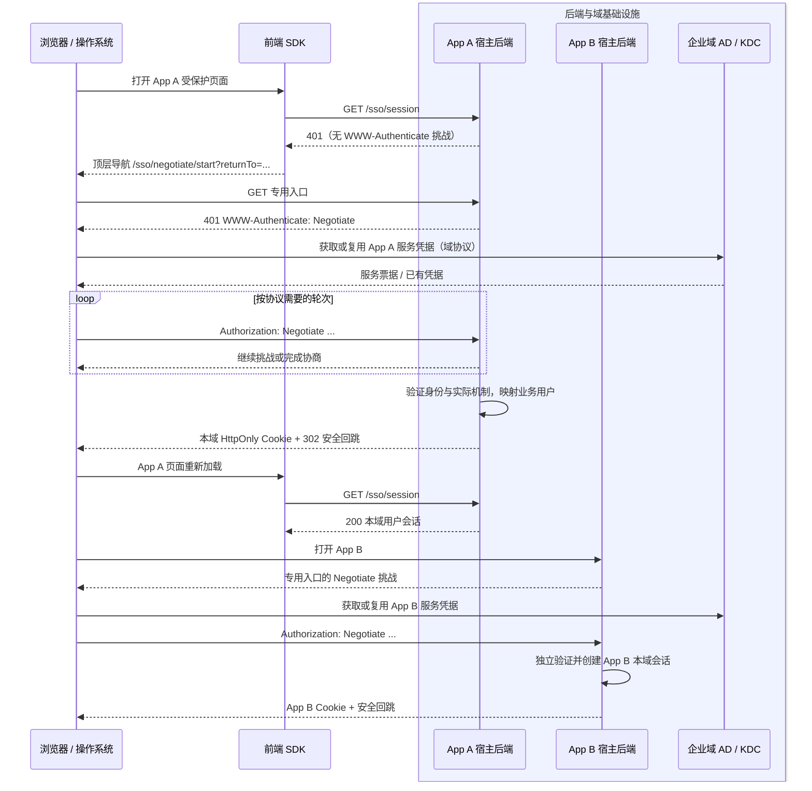

# negotiate-integration：企业内网 HTTP Negotiate 接入

## 目标与支持定位

在现有无框架浏览器 SDK 的 `/negotiate` 入口上，验证业务宿主借助 HTTP Negotiate 和企业域身份服务建立本域会话。前端 SDK 只负责导航、查询会话和呈现登录状态；HTTP 认证由浏览器/操作系统、宿主后端及域基础设施完成。本模块属于首版 OIDC/CAS/SAML 之外的扩展能力。现有适配器单测不能证明 Kerberos 单点登录，只有完成受管浏览器和真实域环境验收后，才能声明此模式已验证。

Negotiate 的统一身份基础设施是 AD/KDC 等域服务，不要求另建一个供浏览器跳转的认证中心网页。App A 和 App B 分别信任同一域身份、配置各自服务主体并创建各自的本域会话；第二个应用的免输密码效果依赖其自身的浏览器策略和服务端配置，不依赖两个应用共享 Cookie。

## 首批适用范围与前提

- 受管企业内网、可使用域凭据的客户端、允许对目标宿主进行集成认证的浏览器，以及已配置服务主体和可信身份映射的宿主。每个宿主使用稳定的 HTTPS FQDN；具体 SPN、运行账号和密钥配置由后端部署方案确定。
- SDK 发起**同源顶层页面导航**至宿主的专用 Negotiate 入口，例如 `GET /sso/negotiate/start?returnTo=...`。宿主在该入口返回 `401 WWW-Authenticate: Negotiate`；浏览器/操作系统可能经历多轮 `Authorization: Negotiate ...` 与挑战响应。完成服务端身份验证后，宿主设置本域会话 Cookie 并跳回安全的业务路径。
- 首批只把**确认协商为 Kerberos**的成功路径计为通过。`Negotiate` 名称本身不保证 Kerberos，部署可能回退至 NTLM；后端需记录实际机制，NTLM 回退不得计入本模块通过结果。不能从一次成功返回或请求头前缀推断已经使用 Kerberos。
- 保留现有 `negotiateAdapter({ loginEndpoint, returnToParam? })` 配置与 `createSSO` 公共接口；不新增 Vue、React 或打包器专用协议实现。已指定的 Vue 3.4.0、Vite 5.0.0 兼容边界沿用宿主兼容模块；Webpack 暂不纳入。
- 不包含 JS 生成/解析 Kerberos 票据、跨源 `fetch` 发起挑战、域加入与浏览器策略下发、Kerberos 委派、NTLM 自动兜底、全局登出。若企业最终需要这些能力，应分别设计和验收。

协议交换与多轮挑战以 [RFC 4559](https://www.rfc-editor.org/rfc/rfc4559.html) 为依据；域环境、宿主与反向代理的部署限制参考 [Microsoft Windows Authentication 文档](https://learn.microsoft.com/en-us/aspnet/core/security/authentication/windowsauth?view=aspnetcore-10.0)。浏览器自动发送凭据受管理策略影响，例如 [Chromium 的 AuthServerAllowlist 策略](https://chromium.googlesource.com/chromium/src/+/ec6891d467174338363f19efc74519c7e9ab521a/components/policy/resources/templates/policy_definitons/HTTPAuthentication/AuthServerAllowlist.yaml) 与 [Firefox 的 SPNEGO 认证策略](https://firefox-admin-docs.mozilla.org/reference/policies/authentication/)。

## 职责与接口契约

| 参与方 | 必须提供或完成 |
| --- | --- |
| 企业域身份服务与浏览器管理方 | 提供可用域身份、目标服务主体和浏览器受信任站点/认证策略；明确支持的客户端、域、DNS、时钟、Kerberos/NTLM 策略，并为 App A、App B 分别准备可测环境。 |
| 业务宿主后端或受信任认证代理 | 提供同源专用挑战入口、会话查询 `GET /sso/session`、本域登出 `POST /sso/logout`；真正验证协商结果并将可信身份映射为业务用户；校验回跳、创建/失效本域会话、独立鉴权业务 API；对失败给出可结束的响应和可用的手动重试/替代登录入口。 |
| 前端 SDK | 用 `negotiateAdapter` 生成同源入口 URL，使用 `createSSO` 查询本域会话、进行一次自动导航、暴露状态和手动重试、执行本域登出；不读取或设置 `Authorization: Negotiate`，不接触域凭据或协商令牌。 |

宿主 `GET /sso/session` 沿用 [SDK 核心契约](sdk-core.md)：已登录返回可映射的用户会话；未登录返回普通 `401` 或 `authenticated:false`，**不在该接口发出 Negotiate 挑战**。否则 SDK 的后台会话查询可能意外触发浏览器认证或系统凭据提示。协议挑战只由专用导航入口发起。网络/服务端故障仍进入 `error`，不得伪装成未登录。`POST /sso/logout` 只失效本域 Cookie；域登录凭据仍可能有效，再次主动或自动登录可重新建立本域会话，这不构成全局退出失败。

宿主登录入口必须将 SDK 传入的 `returnTo` 当作未受信任输入，限制为本站路径并阻断开放重定向。成功后设置 `Secure`、`HttpOnly`、适当 `SameSite` 的会话 Cookie，再 `302` 至安全业务路径。未能协商、用户取消或策略不允许时，不应无限发出挑战；宿主需提供明确的失败路径。可选的交互式登录由宿主实现和配置，SDK 不假定一定存在。浏览器自身可能弹出认证对话框，SDK 无法保证完全不出现。

图中省略了 App B 的相同 SDK 会话查询、导航以及可能的多轮挑战。最后一轮的服务器响应也可能携带供客户端完成协商的 `WWW-Authenticate` 头；测试不能假设恰好一次 `401` 与一次 `Authorization`。域服务交互不是 SDK 发出的 HTTP 请求。

## 失败与安全边界

- 宿主只接受由可信 Negotiate 模块或可信认证代理**已验证**的身份。不得因客户端提交 `Authorization` 或自填 `X-Remote-User` 一类身份头就创建会话；前置代理应剥离客户端伪造身份头，并明确认证终止点与到宿主的信任边界。
- 反向代理、负载均衡、HTTP 版本和连接复用可能改变协商行为。部署前必须验证认证实际发生的位置及连接亲和性，不能把本地直连成功当作经 CDN/代理也成功。对连接绑定的实现按其官方要求配置；无法满足时将部署标为不支持。
- DNS/SPN 错误、时钟偏差、客户端未入域、浏览器不信任站点、票据失效、协商机制不符合策略、代理剥离挑战头、用户取消，均不得建立本域会话。失败页或安全回跳需可见并能让用户手动重试；SDK 的自动导航防循环仍生效。
- 认证入口、会话及回跳响应应避免被共享缓存保存。通过 HTTPS 传输；不得记录或上报 `Authorization` 令牌、票据或会话 Cookie。宿主继续为会话 Cookie 和状态变更 API 配置 CSRF 防护与业务权限校验。
- 本域退出后再次访问受保护页面可能立即由系统凭据完成登录。文档与 UI 必须说明本域退出、浏览器/系统身份状态和其他应用会话的区别；SDK 不承诺清除系统凭据或 App B 会话。

## 验证层级与验收标准

1. **SDK 合同测试**：确认 `/negotiate` 导出、同源入口和自定义回跳参数；公共会话状态、一次自动导航、失败后的手动重试及本域登出沿用核心测试。构建产物无浏览器协议令牌处理代码，类型和包内容检查通过。
2. **本地 HTTP 夹具**：用简版双宿主服务重现会话未登录、专用入口 `401 WWW-Authenticate: Negotiate`、多轮/结束响应形态、成功后建立各自模拟本域会话及失败回跳。负例包括非法回跳、伪造身份头、无效或缺失认证结果、重复挑战/循环、取消与会话过期。夹具不得把头部存在或任意假票据当作真实 Kerberos 验证；该层只证明 SDK 导航、接口约定及失败状态流转。
3. **真实域互操作**：在可记录配置的 AD/KDC 或等效 Kerberos 域、两个不同宿主 FQDN/SPN、真实服务端认证模块及受管浏览器中验证首次登录、App B 免输密码、刷新、会话过期重建和本域退出。服务端需记录协商机制及已验证的用户身份；记录浏览器/系统版本、策略、域/服务主体配置、代理拓扑和脱敏后的挑战轮次。NTLM 回退不能计为成功。
4. **环境与安全负例**：至少验证不受管或禁用信任策略的浏览器、错误 SPN、无效凭据、策略禁止机制、代理场景和安全回跳；观察是否出现系统认证弹窗、401 循环或被静默重试。不同浏览器的结果分开报告，不由一个浏览器推断全部支持。
5. **回归与支持声明**：运行完整 `npm test`、类型构建和 tarball 内容检查；记录每层测试命令、结果与证据。真实域条件未具备时，最多声明“前端适配器及 HTTP 交互夹具通过”，不得将 Negotiate 列为已验证协议。真实业务宿主接入仍须单独验收。

## 设计决定与外部前提

- 首批严格以 Kerberos 为成功标准，不把 NTLM 自动回退计为通过；若目标业务确有 NTLM 需求，需明确适用环境、后端安全策略和独立验收矩阵后再扩大范围。
- 真实域测试环境由业务方或测试环境提供；若暂时不可用，本模块应保留实验支持状态，不能以简版夹具替代完成验收。

## 评审记录

- [x] 用户在收到首批 Kerberos 验收选择和真实域验收门槛后回复“继续”，确认按此范围生成计划（2026-10-01）。
