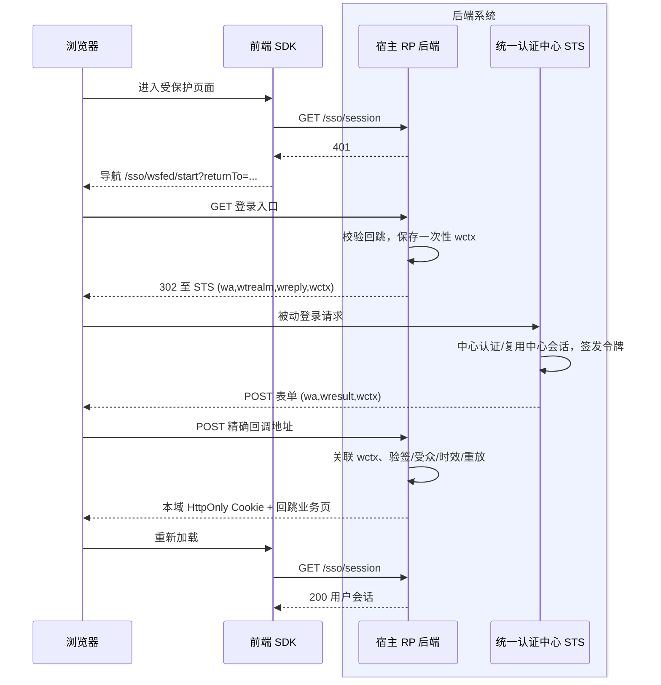

# wsfed-integration：宿主后端 WS-Federation 被动登录

## 目标

在现有无框架浏览器 SDK 的 `/wsfed` 入口上，验证业务宿主后端作为 Relying Party（RP）与统一认证中心 Security Token Service（STS）完成 WS-Federation Web Passive Sign-In。SDK 仍只导航到同源宿主入口并查询本域会话，不在浏览器处理 `wresult`。此模块先将当前“仅有前端入口单测”的实验能力推进到有交互与独立实现证据的状态；是否纳入正式支持，由验收结果决定。

## 首批协议范围

- RP 发起的被动登录：宿主后端向 STS 发起 `wa=wsignin1.0`，固定登记的 `wtrealm` 与 `wreply`，用不可猜测且一次性的 `wctx` 关联请求和安全回跳。
- STS 认证后通过 HTTP POST 把 `wa`、`wresult` 和原样返回的 `wctx` 交给 RP 回调。宿主后端验证可信签名、签发者、目标 realm/受众、回复地址、有效期和重放，再创建本域 `HttpOnly` 会话；业务 API 独立鉴权。
- 首批只针对 `wresult` POST 携带的受支持签名令牌类型设计。具体是 SAML 1.1 还是 SAML 2.0，由所选独立 STS 与 RP 参考实现共同锁定并记录；不能用字符串比对代替签名验证。`wresultptr`、主动请求者、IdP 发起登录、WS-Fed 全局退出不在首批范围。

上述消息字段依据 [OASIS WS-Federation 1.2 §13.6](https://docs.oasis-open.org/wsfed/federation/v1.2/os/ws-federation-1.2-spec-os.pdf) 与 [Microsoft wsignin1.0 响应说明](https://learn.microsoft.com/en-us/openspecs/windows_protocols/ms-mwbf/99bbd73d-f1ed-491c-be6a-5e53d8f9d1e0)。OASIS 对可接受令牌和签名有协议级可选项；本 SDK 的生产接入要求更严格的可信签名与固定信任配置。

## 三方职责与前端配置

| 参与方 | 必须提供或完成 |
| --- | --- |
| 统一认证中心 / STS | 为每个 RP 登记 realm、精确回复地址与信任材料；提供被动登录端点、中心会话和经签名的令牌；明确令牌类型、证书轮换、会话与失败返回行为。 |
| 业务宿主后端 / RP | 提供同源登录入口、POST 回调、会话查询与本域登出；固定 STS 与 realm/reply；保存一次性 `wctx` 与回跳记录；验证 POST、可信签名及所有令牌条件，成功后设置本域 Cookie；拒绝错误令牌和重放。 |
| 前端 SDK | `wsFedAdapter({ loginEndpoint, returnToParam? })` 生成同源宿主登录 URL；`createSSO` 查询宿主会话、处理状态/一次自动登录/手动重试和本域登出。不接收 `wresult`、不管理 STS 证书。 |

`GET session`、`POST logout` 的形态、`session.map`、同源回跳限制和错误语义沿用 [SDK 核心契约](sdk-core.md)。App B 有自己的 RP 与本域会话，可通过同一 STS 中心会话免去再次输入凭据；本域登出不等于 STS 或另一宿主退出。

## 失败与安全边界

- 未知/重复 `wctx`、错误 realm/reply、伪造或过期令牌、错误签发者/受众、无可信签名、跨源回跳均不得建立会话。接入方不得根据浏览器提供的令牌内容动态选择信任证书。
- STS 到宿主的跨站 POST 可能不带 `SameSite=Lax` 宿主 Cookie；回调关联应依靠服务端待处理记录和一次性 `wctx`，并设置过期时间。宿主应限制表单体大小、使用安全 XML 解析、拒绝外部实体及重放。
- 失败或用户取消时，宿主应返回安全业务页并提供可见错误；SDK 不能因未登录而无限自动重试。未知来源回调可直接拒绝。
- 简版夹具只用于证明导航、状态和错误流转，不能作为生产 RP 或 STS 复制。

## 验收标准

1. SDK 单测确认 `/wsfed` 导出、同源登录入口、回跳参数自定义与公共防循环/本域登出；不新增浏览器令牌解析逻辑。
2. 简版双宿主夹具覆盖 `wa/wtrealm/wreply/wctx`、POST 回调、中心会话复用、各自本域会话、非法回跳、错误/过期/重放响应和取消反馈。
3. 使用与简版夹具独立的 WS-Fed STS/RP 实现互操作，锁定产品与版本、令牌类型、配置和信任证书；至少验证双宿主登录、可信签名、错误 realm/受众、过期/重放、中心会话和本域登出。若独立环境无法搭建，只报告“交互夹具通过”，不升级为正式协议支持。可预先评估 [WSO2 Passive STS](https://wso2.com/identity-platform/docs/get-started/try-samples/ws-federation-webapp/) 等独立实现的本机可行性。
4. 在真实浏览器验证首次登录、第二宿主复用、刷新、本域登出和失败后手动重试，记录浏览器、STS/RP 版本与控制台错误。真实生产 STS/RP 仍需业务方联调。
5. 完整 `npm test`、tarball 内容和类型导出通过；对外支持状态与实际验证层级一致。

## 评审记录

- [x] 用户在上一轮收到本规格与独立 STS 验证门槛后回复“继续”，确认按此范围推进（2026-10-01）。
